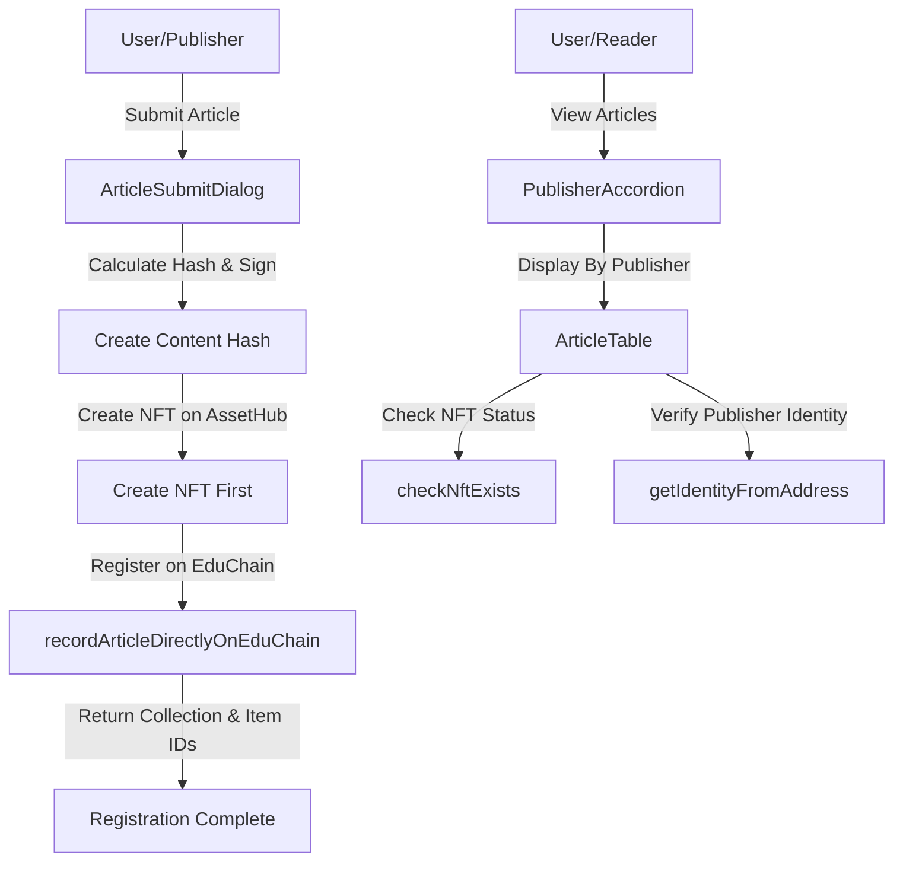

# EduChain - Article Verification System

This document provides a comprehensive explanation of the architecture, workflows, and technical implementation of the EduChain application, which enables verifying and registering news articles on the blockchain. It demonstrates a powerful pattern for building composable applications on Polkadot by leveraging multiple specialized chains while maintaining a seamless user experience.

## System Overview

The EduChain application is a Vue-based web application that demonstrates the power of Polkadot's multi-chain architecture by interacting with multiple specialized blockchain networks to create a verifiable record of news articles. While the backend leverages complex cross-chain functionality, the frontend presents a simple, intuitive interface to users.

The system allows publishers to:

1. Register articles on EduChain with cryptographic proof of authenticity
2. Create corresponding NFTs on AssetHub that reference these articles
3. View and verify articles registered by various publishers

This architecture showcases how developers can build powerful applications by composing specialized chains together while keeping the complexity hidden from end-users.

## Blockchain Networks

This application leverages Polkadot's multi-chain ecosystem to utilize specialized chains for specific functions, composing them into a unified application:

- **EduChain**: Primary source of truth for article provenance and metadata
- **AssetHub**: Used for NFT representation of verified articles, leveraging standardized NFT functionality
- **PeopleHub**: Provides identity verification for publishers, serving as a trust layer

By utilizing specialized chains for specific functions, we can leverage the best capabilities of each without requiring any single chain to handle all responsibilities. To the end user, this multi-chain interaction is completely transparent.

## Core Components

### Key Application Components

- **ArticleSubmitDialog**: UI for submitting and registering new articles
- **ArticleTable**: Displays articles and their verification status
- **PublisherAccordion**: Groups articles by publisher with identity verification

### Vue Composables

Composables are a core concept in Vue.js that enable reusing stateful logic across components:

#### 1. `useTransaction` Composable

**File Path:** `src/composables/useTransaction.ts`

**Purpose**: Centralizes all blockchain transaction logic and state management. It provides reactive state variables and methods for executing various blockchain transactions while handling errors and transaction states consistently.

**Reactive State Variables**:
- `isPending`: Boolean flag indicating if a transaction is currently in progress
- `isSuccess`: Boolean flag indicating if the last transaction completed successfully
- `error`: Error object that gets populated when a transaction fails
- `result`: String containing human-readable result of the transaction
- `txHash`: String containing the transaction hash, useful for block explorers

**Key Methods**:
- `resetState()`: Resets all state variables before starting a new transaction
- `handleError()`: Common error handling logic for all transactions
- `createNftForRegisteredArticle()`: Creates NFTs for articles already registered on EduChain
- `recordArticleDirectlyOnEduChain()`: Records a new article directly on EduChain
- `recordArticleOnEduChain()`: Records and verifies article provenance on EduChain

#### 2. `useConnect` Composable

**File Path:** `src/composables/useConnect.ts`

**Purpose**: Manages wallet connection state and user accounts, providing a unified interface for connecting to and interacting with blockchain wallets.

**Reactive State Variables**:
- `selectedAccount`: The currently selected wallet account
- `isConnected`: Boolean flag indicating if a wallet is connected
- `accounts`: Array of available accounts from the connected wallet

#### 3. `useCurrentBlock` Composable

**File Path:** `src/composables/useCurrentBlock.ts`

**Purpose**: Provides reactive state for tracking the current blockchain block height and related information.

## Data Flow



## Registration Workflow (Updated)

From the user's perspective, registering an article is a simple process:

1. **Article Submission**:
   - User enters article details (title, URL, content)
   - System calculates content hash using selected algorithm (Blake2b-256)
   - User signs the hash with their wallet through a single prompt

2. **Behind the Scenes - NFT Creation**:
   - System transparently checks if publisher already has a collection on AssetHub
   - If no collection exists, a new one is created with a batch transaction
   - NFT is minted with the content hash as metadata
   - This ensures we have confirmed collection and item IDs

3. **Behind the Scenes - EduChain Registration**:
   - Using the confirmed collection and item IDs from AssetHub
   - Article details, hash, and signature are registered on EduChain
   - EduChain stores the canonical article record with consistent IDs

Although this workflow involves multiple chains and complex operations, the user experiences it as a single, seamless process with clear feedback at each stage. This demonstrates how Polkadot enables developers to compose functionality across specialized chains while maintaining an intuitive user experience.

## Verification Workflow

1. **Article Display**:
   - Application fetches all articles from EduChain
   - Groups articles by publisher
   - Verifies publisher identities from PeopleHub

2. **NFT Status Check**:
   - For each article, check if corresponding NFT exists on AssetHub
   - Display verification status (Verified NFT or NFT Missing)

3. **Identity Verification**:
   - System checks if publishers have verified identities on PeopleHub
   - Displays identity status (Verified Identity or Unverified Identity)

## Key Functions

### SDK Interface Layer

**File Path:** `src/utils/sdk-interface.ts`

The SDK interface layer provides an abstraction over direct blockchain API calls, making them easier to use throughout the application:

#### Primary Functions

- `recordArticleDirectlyOnEduChain`: Creates NFT first, then registers article on EduChain with confirmed IDs
  ```typescript
  async function recordArticleDirectlyOnEduChain(
    title: string,
    canonicalUrl: string,
    publisherAddress: string,
    contentHash: string,
    signature: string,
    hashAlgo: HashAlgo,
    wordCount: number
  ): Promise<{ collectionId: number, itemId: number, nftCreated: boolean }>
  ```

- `createPublisherCollection`: Creates a new collection for a publisher with a batch transaction
  ```typescript
  async function createPublisherCollection(
    publisherAddress: string
  ): Promise<number>
  ```

- `getAllDisplayArticles`: Fetches all articles from EduChain
  ```typescript
  async function getAllDisplayArticles(): Promise<ArticleRecord[]>
  ```

- `checkNftExists`: Checks if an NFT exists for a specific article
  ```typescript
  async function checkNftExists(
    collectionId: number, 
    itemId: number, 
    hash: string
  ): Promise<boolean>
  ```

- `getIdentityFromAddress`: Retrieves publisher identity information
  ```typescript
  async function getIdentityFromAddress(
    address: string
  ): Promise<Identity | undefined>
  ```

#### Legacy Functions

These functions are maintained for backward compatibility but the new flow uses `recordArticleDirectlyOnEduChain` which handles both NFT creation and EduChain registration:

- `createNftForRegisteredArticle`: Creates an NFT on AssetHub for an existing article
- `recordArticleOnEduChain`: Records an article on EduChain (assumes NFT exists)

### Reactive Toast Notifications

The application uses PrimeVue toast components with Vue watchers to provide real-time feedback:

```javascript
// Watch for transaction state changes
watch(isPending, (newValue) => {
  if (newValue) {
    toast.add({ severity: 'info', summary: 'Processing', detail: 'Transaction is being processed...' })
  }
})

watch(isSuccess, (newValue) => {
  if (newValue) {
    toast.add({ severity: 'success', summary: 'Success', detail: result.value })
  }
})

watch(error, (newValue) => {
  if (newValue) {
    toast.add({ severity: 'error', summary: 'Error', detail: newValue.message })
  }
})
```

## Transaction Pattern

The application uses a consistent pattern for blockchain transactions:

1. **Transaction Creation**: Prepare the transaction parameters
2. **Batch Processing**: Where possible, combine multiple operations into a batch transaction
3. **Promise-Based API**: Return a Promise that resolves when the transaction is finalized
4. **Subscription Pattern**: Use RxJS `subscribe({ next, error })` pattern for transaction monitoring
5. **Consistent Error Handling**: Provide meaningful error messages and proper error resolution

Example pattern:
```typescript
return new Promise((resolve, reject) => {
  tx.signSubmitAndWatch(signer).subscribe({
    next(event) {
      if (event.type === 'finalized') {
        console.log(`Transaction finalized successfully`);
        resolve({ success: true, ... });
      }
    },
    error(e) {
      console.error('Error with transaction:', e);
      reject(e);
    }
  });
});
```

## Component Hierarchy and Communication

- **App.vue**: Main container that manages global state and high-level user flows
- **PublisherAccordion.vue**: Displays grouped articles by publisher
- **ArticleTable.vue**: Shows individual articles within each publisher group
- **DialogComponents**: Handle specific user interactions like submission and verification

Components communicate through:
1. Props (parent to child)
2. Events (child to parent)
3. Shared composables (for global state)

## Utility Functions

**File Path:** `src/utils/formatters.ts`

Utility functions handle common formatting tasks like:
- Converting blockchain addresses to display format
- Formatting currency amounts
- Converting timestamps to human-readable dates

## Conclusion

The EduChain application demonstrates the power of building composable applications on Polkadot's multi-chain ecosystem. By leveraging specialized chains for specific functions - EduChain for provenance, AssetHub for NFTs, and PeopleHub for identity - we create a robust system that would be difficult to implement on a single chain.

### Multi-Chain Composability Benefits

1. **Specialized Functionality**: Each chain provides optimized functionality for its specific purpose
2. **Separation of Concerns**: Clear boundaries between verification, ownership, and identity systems
3. **Future Extensibility**: New chains or functionality can be integrated without disrupting existing operations
4. **Scalability**: Workload is distributed across multiple chains rather than concentrated on one
5. **User Simplicity**: Despite the complex backend, users experience a seamless interface

The frontend architecture leverages Vue.js composables to create a clean separation of concerns:
1. **UI Components**: Focus on presentation and user interaction
2. **Composables**: Handle state management and business logic
3. **SDK Layer**: Abstracts multi-chain interaction details

This application serves as a template for how developers can build sophisticated applications on Polkadot by composing functionality across specialized chains while maintaining an intuitive user experience. By thinking in terms of specialized chains working together rather than forcing all functionality onto a single chain, we can create more robust, maintainable, and scalable applications.