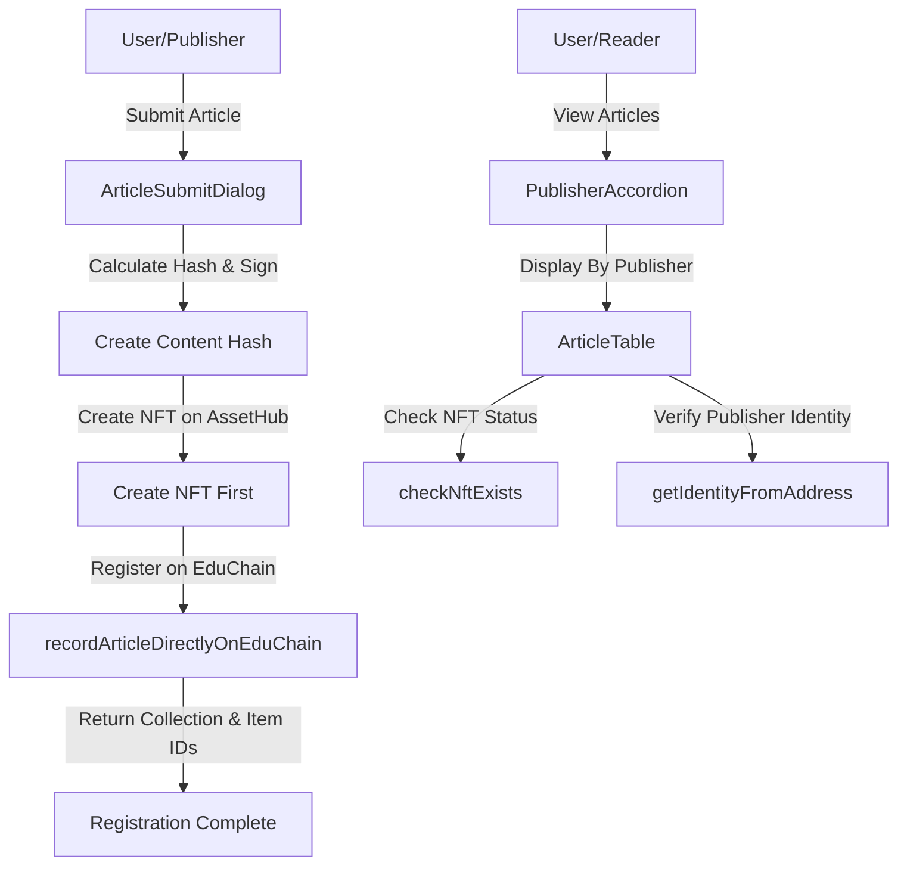

# EduNews - Demo Article Verification System

> **📚 EDUCATIONAL PROJECT**: This is a learning-focused implementation created to explore Polkadot's multi-chain ecosystem. It is not intended for production use and serves primarily as an educational resource.


A **Vue 3 + TypeScript** application that demonstrates how blockchain technology could potentially fight misinformation by creating an immutable, verifiable record of news articles using Polkadot's multi-chain ecosystem.

## 📰 Project Overview

EduNews is an educational prototype that illustrates a potential solution for verifying article authenticity and provenance using blockchain technology. This learning project combines multiple specialized chains within the Polkadot ecosystem:

- **EduChain**: Stores article metadata, provenance data, and content hashes
- **AssetHub**: Creates NFT representations of verified articles for ownership proof
- **PeopleHub**: Verifies publisher identities to establish trust

> To launch, local instance of EduChain and AssetHub, you can use this one-command deployment to run it locally: [Local EduChain Deployment.](https://github.com/w3f/educhain?tab=readme-ov-file#local-development-chain)

This experimental approach demonstrates how developers can learn to build cross-chain applications that maintain a seamless user experience while benefiting from specialized chain functionality.

## 🎓 Educational Purpose

This project was created with the following learning objectives:

1. Explore practical applications of Polkadot's multi-chain architecture
2. Understand cross-chain composition through a concrete use case
3. Demonstrate blockchain concepts like content verification and digital signatures
4. Provide a starting point for developers interested in Polkadot development

This project is not production-ready software, rather it is meant to showcase the above.

## 🔄 How It Works

**For Publishers:** (Demonstration Flow)
1. Publisher connects their Polkadot wallet (Polkadot.js, SubWallet, Talisman)
2. They submit article details and content through the UI
3. The app hashes the content with Blake2b-256 and requests signature with their private key
4. The system creates an NFT on AssetHub and registers the article on EduChain
5. The verified article receives a verification badge publishers can embed on their sites

**For Readers:** (Conceptual User Journey)
1. Readers can verify article authenticity by checking the EduNews registry
2. Each article displays verification status, publisher identity, and blockchain timestamp
3. Embedded verification badges on publisher sites link back to blockchain proof

## 🛠️ Technical Architecture

### Cross-Chain Flow (Conceptual Model)



### Key Components
- **Transaction Handling**: `useTransaction.ts` manages the multi-chain transaction flow via Vue Composables
- **Blockchain SDK**: Built on PAPI (https://papi.how/) for type-safe chain interaction
- **Identity Verification**: PeopleHub integration for real-world publisher identity proof

### Core Files
- `src/utils/sdk-interface.ts` - Core blockchain interaction functions
- `src/components/ArticleSubmitDialog.vue` - Article submission and verification UI
- `src/composables/useTransaction.ts` - Multi-chain transaction orchestration

## 🧩 Tech Stack

- **Frontend**: Vue 3 with Composition API + TypeScript
- **UI Components**: PrimeVue with Toast notifications and responsive design
- **Blockchain SDK**: Polkadot API (PAPI) for type-safe chain interactions
- **Wallet Integration**: @talismn/connect-wallets for multi-wallet support

## 🚀 Getting Started

> Note: This project is intended for educational purposes and experimentation. The setup process may require troubleshooting as this is not production software.

### Prerequisites
- Node.js v18+ and npm
- A Polkadot wallet extension (Polkadot.js, SubWallet, or Talisman)
- [Locally running EduChain instance](https://github.com/w3f/educhain?tab=readme-ov-file#local-development-chain)

### Installation
```bash
# Clone the repository
git clone https://github.com/w3f/edunews
cd edunews

# Install dependencies
npm install

# Generate PAPI chain descriptors
npm run postinstall
```

Before running the development server, ensure you are running a local instance of EduChain,[ which you can do here.](https://github.com/w3f/educhain?tab=readme-ov-file#local-development-chain)

```sh
# Start development server
npm run dev
```

### Configuration
- Chain endpoints are configured in `src/utils/sdk.ts`
- Default networks include Paseo (testnet) and its parachains
- For local development, update RPC endpoints in `config` object

## 📦 Project Structure

```
src/
├── components/     # Vue UI components
│   ├── ArticleSubmitDialog.vue  # Article submission form and workflow
│   ├── PublisherAccordion.vue   # Display of publisher articles
│   └── ...
├── composables/    # Vue composition functions
│   ├── useConnect.ts        # Wallet connection logic
│   ├── useTransaction.ts    # Transaction management
│   └── useCurrentBlock.ts   # Block monitoring
├── utils/          # Utility functions
│   ├── sdk.ts               # Chain configuration and client setup
│   ├── sdk-interface.ts     # Core blockchain interaction functions
│   └── formatters.ts        # Data formatting utilities
├── chain/          # Chain-specific code
│   └── papi.ts              # PAPI client initialization
├── descriptors/    # Generated chain descriptors
└── types.ts        # TypeScript type definitions
```

## 🤝 Contributing

This educational project welcomes contributions that enhance its learning value! Please follow these steps:

1. Fork the repository
2. Create your feature branch (`git checkout -b feature/amazing-feature`)
3. Commit your changes (`git commit -m 'Add some amazing feature'`)
4. Push to the branch (`git push origin feature/amazing-feature`)
5. Open a Pull Request

## ⚠️ Limitations and Disclaimers

- This project is a learning tool and not suitable for production environments
- The implementation focuses on demonstrating concepts rather than security or scalability
- Many features are simulated or simplified for educational purposes
- Use the code as a reference for learning, but implement proper security measures for any derived work

## 📄 License

This project is licensed under the MIT License - see the LICENSE file for details.

## 🔗 Resources

- [PAPI Documentation](https://papi.how/)
- [Vue 3 Documentation](https://vuejs.org/)
- [Polkadot Wiki](https://wiki.polkadot.network/)